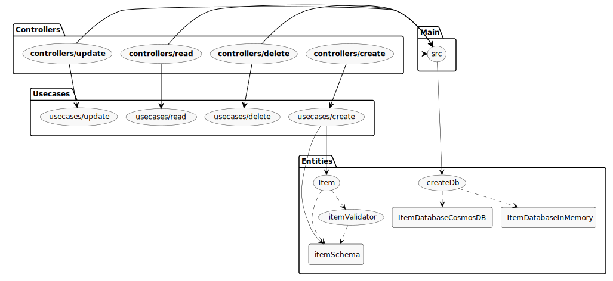

[](https://codeclimate.com/github/mikaelvesavuori/serverless-azure-cosmosdb-crud/maintainability)

# Serverless CRUD: Azure Cosmos DB (SQL) through Azure Functions

This is a starter package for doing serverless CRUD operations on Azure. See it as a good "starting point plus" (Typescript, Webpack, Serverless Framework, Clean Architecture/DDD-style structure) if you are not satisfied with the more basic examples on the web. Since Node is a bit second-rate in the Microsoft world, finding solid, bigger examples can be a tad tough. Hopefully you get going fast with this one!

The code is somewhat modeled after an official Microsoft example at [https://docs.microsoft.com/en-us/azure/cosmos-db/sql-api-nodejs-get-started](https://docs.microsoft.com/en-us/azure/cosmos-db/sql-api-nodejs-get-started).

**Stack**

- [Serverless Framework](https://www.serverless.com)
- [Azure Functions](https://azure.microsoft.com/en-us/services/functions/) + [API Management](https://azure.microsoft.com/en-us/services/api-management/) + [Azure Cosmos DB (SQL)](https://azure.microsoft.com/en-us/services/cosmos-db/) + [Azure Storage](https://azure.microsoft.com/en-us/services/storage/) (for storing the functions)
- [Webpack](https://webpack.js.org) for bundling and optimizing
- [Babel](https://babeljs.io) for transpiling files
- [Typescript](https://www.typescriptlang.org) so we can write better code

**Thinking of using this in production?**

- Pro tip: Absolutely use `sls offline` to verify and test stuff locally. Azure is just so much harder to use when you want to view logs compared to GCP and AWS, so you will be saving a lot of time doing the local dev stuff as long as you can.
- If you will use this in production, you should definitely find another pattern for storing and setting your sensitive keys (like connection strings). Look at environment variables, deployment variables, maybe some Azure key/secret management solution, or something along those lines.
- Also, for production, you might want to look at patterns to save your Cosmos database from being overrun with requests. Look at maybe a messaging or event solution to go in between the API and the database. While Azure Functions can scale quickly, SQL cannot.

## Structure

- **`scripts/deploy.sh`**: Deployment shell script
- **`scripts/teardown.sh`**: Script to remove your resource group and anything in it
- **`arm/`**: Azure ARM templates to deploy some of the resources
- **`docs/`**: Documentation generated with Typedoc
- **`src/contracts`**: Contracts (interfaces) for various things
- **`src/controllers`**: The primary entrypoint for the serverless handlers
- **`src/frameworks`**: Helpers and any "details" like databases and request validators, anything that's not application-specific
- **`src/usecases`**: Where the actual business logic should take place — in this project it's nothing more than sending data down to the right database functionality
- **`src/entities/ItemDatabase`**: Where we store domain objects (entities). In our case it's a factory to create a ItemDatabase

### Arkit code structure map



## Install

Run `npm install` or `yarn add`.

## Configuration

Database configuration should be done in `src/config.ts` for connection strings and such, and in `serverless.yml` for anything that has to do with the actual deployment.

**NOTE**: Remember that storing sensitive data like connection strings in a checked-in file is **not** a good thing, and this is something you would want to do with a secrets manager or something, in a production setting.

You can get the required connection string (primary key works fine) and endpoint URI either inside of the visual Azure console or by running the bottom-most command found in `./scripts/deploy.sh`.

## Log in to Azure

1. `az account clear`
2. `az login`

Then set credentials as per instructions at [https://github.com/serverless/serverless-azure-functions#advanced-authentication](https://github.com/serverless/serverless-azure-functions#advanced-authentication).

## Development

**You will need to deploy a database before doing any development! Read more in the "Deploying" section below.**

Run `sls offline`. You may be asked if you want to accept incoming requests for `func`, accept those. After a bit of building files and doing its magic, you get a prompt looking like:

```
Http Functions:

update: [PATCH] http://localhost:7071/api/update
delete: [DELETE] http://localhost:7071/api/delete
read: [GET] http://localhost:7071/api/read
create: [POST] http://localhost:7071/api/create
```

Hit any of those URLs and you're ready!

**NOTE!**
_Your Node version will need to be 12_ (or whatever version is used on Azure). One way of handling multiple Node versions is with [`nvm`](https://github.com/nvm-sh/nvm). If you are set on using it, these instructions should get you up and ready for development:

1. `nvm install 12`, to install Node 12
2. `nvm use 12`, to use Node 12
3. When you are done, run `nvm unload` but this will also eject the environment variables so `nvm` will be an unknown command from that point on (just run the commands again from `~/.zshrc` or where ever those got put in the first place)

## Requests and examples

### Create

You can create a record/item with some simple string fields (`category`, `name`, `description`). All fields are mandatory.

#### Query

```
/POST http://localhost:7071/api/create

{
  "category": "something",
  "name": "nice name here",
  "description": "what it is"
}
```

#### Response

```
{
  "id": "5558",
  "category": "something",
  "name": "nice name here",
  "description": "what it is",
}
```

### Read

You can read a single, or all, records.

#### Query (read all)

```
/GET http://localhost:7071/api/read/
```

#### Response

```
[
  {
    "id": "8222",
    "category": "asdf",
    "name": "that-guy",
    "description": "something",
  },
  {
    "id": "5667",
    "category": "something",
    "name": "nice name here",
    "description": "what it is",
  }
]
```

#### Query (read single)

```
/GET http://localhost:7071/api/read/?id=5667
```

#### Response

```
[
  {
    "id": "5667",
    "category": "something",
    "name": "nice name here",
    "description": "what it is",
  }
]
```

### Update

You can update an existing record. Cosmos DB does not support partial updates. To "fix" this, the ItemDatabase will always get the existing record first before selectively updating the fields you pass in.

#### Query

```
/PATCH http://localhost:7071/api/update?id=8222&category=asdf&name=that-guy&description=something
```

#### Response

```
{
  "updatedItem": {
    "id": "8222",
    "category": "asdf",
    "name": "that-guy",
    "description": "something",
  }
}
```

### Delete

You can delete a single record by passing in the ID of the record that should be deleted.

#### Query

```
/DELETE http://localhost:7071/api/delete/?id=268
```

#### Response

```
{
  "deletedItem": "268"
}
```

## Testing

Jest is used for unit testing and some kind of basic system testing for the controllers and use cases.

Because Typescript support is not fully 100% I suggest you first build your TS files into JS files and then test those. Therefore, you'll see in the tests that they point to the `dist` folder and their respective files. This is already handled by `npm test` or `yarn test` commands and the current setup, but just so you know.

The tests that exist are for basic coverage so expect that you might need to harden them should you want to use this repo in production.

## Deploying

### Infrastructure

Run `sh ./scripts/deploy.sh` or `npm run init` or `yarn init` to deploy the Azure ARM templates.

### Functions and API

Run `sls deploy` or `npm run deploy` or `yarn deploy` to do a regular "dev" stage deployment of the functions and their API.

## Taking the project down

Run `sh ./scripts/teardown.sh` or `npm run teardown` or `yarn teardown` to remove the resource group with the CosmosDB instance.

## Logging and monitoring

Logs should be available in [Azure Monitor Logs](https://portal.azure.com/#blade/Microsoft_Azure_Monitoring/AzureMonitoringBrowseBlade/logs) and `Monitoring > Log stream` in the Functions App panel.

**References**:

- [https://docs.microsoft.com/en-us/azure/azure-functions/functions-monitor-log-analytics?tabs=javascript](https://docs.microsoft.com/en-us/azure/azure-functions/functions-monitor-log-analytics?tabs=javascript)
- [https://docs.microsoft.com/en-us/azure/azure-functions/functions-monitoring?tabs=cmd#write-logs-in-javascript-functions](https://docs.microsoft.com/en-us/azure/azure-functions/functions-monitoring?tabs=cmd#write-logs-in-javascript-functions)
- [https://github.com/BrianRosamilia/azure-function-log-intercept](https://github.com/BrianRosamilia/azure-function-log-intercept)

## References

- [https://docs.microsoft.com/en-us/azure/cosmos-db/sql-api-nodejs-get-started](https://docs.microsoft.com/en-us/azure/cosmos-db/sql-api-nodejs-get-started)
- [https://docs.microsoft.com/en-us/azure/azure-functions/functions-integrate-store-unstructured-data-cosmosdb?tabs=javascript](https://docs.microsoft.com/en-us/azure/azure-functions/functions-integrate-store-unstructured-data-cosmosdb?tabs=javascript)
- [https://dev.to/azure/explore-cosmos-with-serverless-422o](https://dev.to/azure/explore-cosmos-with-serverless-422o)
- [Manage Azure Cosmos resources using Azure CLI](https://docs.microsoft.com/en-us/azure/cosmos-db/manage-with-cli)
- [Azure Cosmos DB pricing](https://azure.microsoft.com/en-us/pricing/details/cosmos-db/)
- [How to make the most of Azure Cosmos DB’s free tier](https://www.infoworld.com/article/3531711/using-azure-cosmos-dbs-free-tier.html)

## Warnings, problems, troubleshooting...

- It's not uncommon to get a 400 error (`Error creating APIM Property`) when deploying with `sls deploy`. Just wait a few seconds and try again, and it should normally work on the second attempt.
- There is supposedly support to configure `apim` (API Management) in `serverless.yml` but somehow you will start getting deployment errors (`-> Function App not ready. Retry 0 of 30...` and continuing) if you mess about with that stuff. To the best of my abilities, I think I've located the error to be on the `backends` section. Maybe it's not mapping correctly? Following a slightly modified version of the config in the [Serverless Framework provider reference](https://www.serverless.com/framework/docs/providers/azure/guide/serverless.yml/) does not work, at least.
- Serverless Framework and Azure together seem to have—at best—a fragile friendship. Expect that deployments stop working every now and then. Resolution is unclear; removing and redeploying (while a useless option that cannot be done safely in production) does not always seem to work either. Moving the region (also unsafe) seems to work better, but only ever do that _during_ development and not after.
